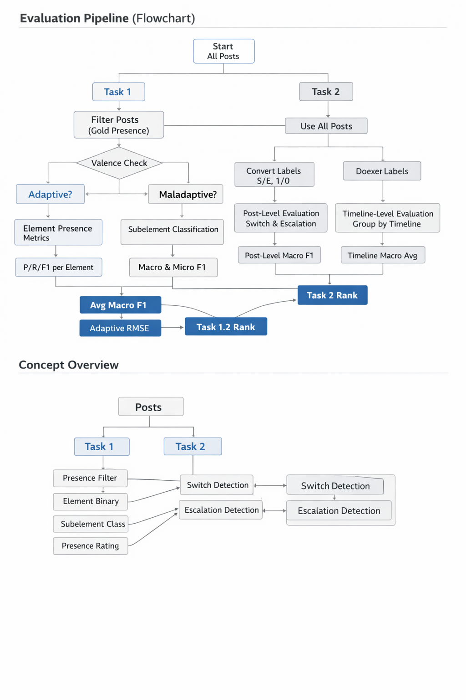

# CLPsych 2026 — Shared Task Evaluation

This repository contains the evaluation logic, metrics, submission format, and scoring pipeline for the **CLPsych 2026 Shared Task**.

The shared task consists of:

- **Task 1.1** — ABCD Element & Subelement Classification
- **Task 1.2** — Presence Rating
- **Task 2** — Moments of Change (Switch & Escalation)
# Table of Contents

- [Evaluation Pipeline](#evaluation-pipeline)
- [Concept Overview](#concept-overview)
- [1. Evaluation Overview](#1-evaluation-overview)
  - [Task 1.1 — ABCD Element & Subelement Classification](#task-11--abcd-element--subelement-classification)
  - [Task 1.2 — Presence Rating](#task-12--presence-rating)
  - [Task 2 — Moments of Change](#task-2--moments-of-change)
- [2. Task 1.1 Evaluation Logic](#2-task-11-evaluation-logic)
  - [Overview](#overview)
  - [Step 1: Post Filtering](#step-1-post-filtering)
  - [Step 2: Per-Valence Filtering](#step-2-per-valence-filtering)
  - [Step 3: Data Collection](#step-3-data-collection)
  - [Step 4: Element Presence Metrics](#step-4-element-presence-metrics)
  - [Step 5: Subelement Classification Metrics](#step-5-subelement-classification-metrics)
  - [Task 1.1 Ranking](#task-11-ranking)
  - [Task 1.1 Pipeline Summary](#task-11-pipeline-summary)
- [3. Task 1.2 Evaluation Logic](#3-task-12-evaluation-logic)
  - [Overview](#overview-1)
  - [Step 1: Post Filtering](#step-1-post-filtering-1)
  - [Step 2: Per-Valence Filtering](#step-2-per-valence-filtering-1)
  - [Step 3: Collect Rating Pairs](#step-3-collect-rating-pairs)
  - [Step 4: Compute Metrics](#step-4-compute-metrics)
  - [Reporting Structure](#reporting-structure)
  - [Task 1.2 Ranking](#task-12-ranking)
  - [Task 1.2 Pipeline Summary](#task-12-pipeline-summary)
- [4. Task 2 Evaluation Logic](#4-task-2-evaluation-logic)
  - [Overview](#overview-2)
  - [Step 1: Post Filtering](#step-1-post-filtering-2)
  - [Step 2: Label Parsing](#step-2-label-parsing)
  - [Post-Level Evaluation](#post-level-evaluation)
  - [Timeline-Level Evaluation](#timeline-level-evaluation)
  - [Why both post-level and timeline-level?](#why-both-post-level-and-timeline-level)
  - [Task 2 Ranking](#task-2-ranking)
  - [Task 2 Pipeline Summary](#task-2-pipeline-summary)
- [5. Evaluation Metrics Summary](#5-evaluation-metrics-summary)
- [6. Post Filtering Rules](#6-post-filtering-rules)
- [7. Environment](#7-environment)
- [8. Subelement Schema](#8-subelement-schema)
- [9. Submission Format](#9-submission-format)
- [10. Submission Validation Script](#10-submission-validation-script)
- [11. Running the Evaluation Locally](#11-running-the-evaluation-locally)
- [12. scores.txt Key Names](#12-scorestxt-key-names)
- [13. Final Summary](#13-final-summary)


# Evaluation Pipeline

The following diagram summarizes the full evaluation flow across Task 1 and Task 2.



## What the flowchart shows

- **Task 1** starts from all posts, then filters to only posts with gold evidence
- It then evaluates each valence independently:
  - **Element presence**
  - **Subelement classification**
  - **Presence rating**
- **Task 2** uses **all posts**
  - Converts Switch/Escalation labels into binary form
  - Computes both **post-level** and **timeline-level** metrics
- Final ranking metrics are derived separately for:
  - **Task 1.1**
  - **Task 1.2**
  - **Task 2**


# Concept Overview

The diagram also captures the conceptual relationship between the tasks:

- **Task 1** focuses on:
  - Presence filtering
  - Element-level binary prediction
  - Subelement multi-class prediction
  - Presence rating
- **Task 2** focuses on:
  - Switch detection
  - Escalation detection
  - Evaluation both at post level and timeline level


# 1. Evaluation Overview

## Task 1.1 — ABCD Element & Subelement Classification

Each post may contain:

- an **adaptive self-state**
- a **maladaptive self-state**

Within each self-state, up to **6 ABCD elements** may be present:

```text
A, B-O, B-S, C-O, C-S, D
````

Each present element must receive exactly **one valid subelement** label.

### Two evaluation layers

1. **Element presence** — binary classification for each element
2. **Subelement classification** — multi-class classification for the selected subelement when the element is present


## Task 1.2 — Presence Rating

Each self-state also has a **Presence rating (1–5)** measuring psychological centrality.


## Task 2 — Moments of Change

Each post is evaluated for two independent binary labels:

* **Switch**
* **Escalation**

A post may have:

* neither
* only Switch
* only Escalation
* both


# 2. Task 1.1 Evaluation Logic

## Overview

Task 1.1 evaluates two levels:

1. **Element presence** (binary): is element X present in this valence?
2. **Subelement classification** (multi-class): if present, which subelement was selected?


## Step 1: Post Filtering

Only posts with at least one valid `Presence` value in gold are evaluated. Posts with empty evidence are skipped entirely.

```text
375 total posts → ~225 posts with evidence → evaluated
~150 posts with no evidence → skipped
```


## Step 2: Per-Valence Filtering

Within an evaluated post, each valence is checked independently.

If a post has `adaptive-state.Presence = 3` but no `maladaptive-state` evidence, then only the adaptive side is evaluated.

The 6 maladaptive element slots are **not evaluated at all** for that post:

* no TP
* no FP
* no FN
* no TN


## Step 3: Data Collection

For each valence that passed Step 2, all 6 elements are compared between gold and prediction.

### Element presence — binary

| Element | Gold            | Pred            | Binary (g, p) | Result |
| ------- | --------------- | --------------- | ------------- | ------ |
| A       | present (sub=3) | present (sub=5) | (1, 1)        | TP     |
| B-O     | present (sub=1) | absent          | (1, 0)        | FN     |
| B-S     | absent          | present (sub=1) | (0, 1)        | FP     |
| C-O     | absent          | absent          | (0, 0)        | TN     |
| C-S     | absent          | absent          | (0, 0)        | TN     |
| D       | present (sub=2) | present (sub=1) | (1, 1)        | TP     |

### Subelement classification — multi-class label

| Element | Gold label | Pred label |
| ------- | ---------- | ---------- |
| A       | 3          | 5          |
| B-O     | 1          | 0          |
| B-S     | 0          | 1          |
| C-O     | 0          | 0          |
| C-S     | 0          | 0          |
| D       | 2          | 1          |

This gives the per-post vector:

```text
Gold adaptive:  [A:3, BO:1, BS:0, CO:0, CS:0, D:2]
Pred adaptive:  [A:5, BO:0, BS:1, CO:0, CS:0, D:1]
```


## Step 4: Element Presence Metrics

After processing all posts, each element × valence accumulates binary gold/prediction lists.

Example:

```text
adaptive-state:A
gold: [1,0,1,1,0,0,1,...]
pred: [1,0,0,1,1,0,1,...]
```

Metrics computed:

* **Per-element Precision, Recall, F1**
* **Per-valence Macro F1 and Micro F1**
* **Avg Macro F1 / Avg Micro F1**
* **Overall Macro F1 / Overall Micro F1**
* **Support** = number of gold positives for each element × valence pair


## Step 5: Subelement Classification Metrics

Each element is treated as a multi-class problem over:

```text
{0 = absent, 1, 2, ..., K}
```

where `K` is the number of valid subelements for that element.

### Important scoring rule

F1 is computed **only over positive classes**.
Class `0` (absent) is excluded because absence is already handled in element presence evaluation.

This means:

* wrong subelement (`gold=3, pred=5`) → FN for class 3, FP for class 5
* missing element (`gold=3, pred=0`) → FN for class 3
* false element (`gold=0, pred=5`) → FP for class 5
* both absent (`gold=0, pred=0`) → ignored

### Per-element metrics

For each element:

* **Macro F1** = mean F1 across valid subelement classes
* **Micro F1** = pooled TP/FP/FN across valid subelement classes

### Aggregation

* **Adaptive Macro F1** = mean of 6 adaptive element macro F1 scores
* **Adaptive Micro F1** = pooled across all adaptive elements
* **Maladaptive Macro F1 / Micro F1** = same
* **Avg Macro F1 / Avg Micro F1** = mean of adaptive and maladaptive
* **Overall Macro F1 / Overall Micro F1** = across all 12 element × valence pairs

### Example

For `adaptive-state:A` across 5 posts:

| Post | Gold | Pred | Effect                         |
| ---- | ---- | ---- | ------------------------------ |
| 1    | 3    | 3    | TP for class 3                 |
| 2    | 5    | 3    | FN for class 5, FP for class 3 |
| 3    | 0    | 0    | ignored                        |
| 4    | 3    | 0    | FN for class 3                 |
| 5    | 0    | 2    | FP for class 2                 |

**Note:** For elements with only one subelement (`B-S`, `C-S`), subelement F1 is equivalent to element presence F1.


## Task 1.1 Ranking

Ranking uses **subelement classification only**.

1. Compute **Macro F1 per element** for all 12 element × valence pairs
2. Macro-average over the 6 elements within each valence
3. Average adaptive and maladaptive macro F1

```text
Task 1.1 Ranking = Subelement Classification Avg Macro F1
```


## Task 1.1 Pipeline Summary

```text
Post filtering:          only posts with gold Presence
  └─ Valence filtering:  only valences with gold Presence in that post
       ├─ Element presence: binary per element → P/R/F1 per element, per valence, overall
       └─ Subelement classification: multi-class per element → F1 per element, per valence, overall
```


# 3. Task 1.2 Evaluation Logic

## Overview

Task 1.2 evaluates the **Presence rating** (1–5 ordinal scale) for each self-state.

---

## Step 1: Post Filtering

Same as Task 1.1: only posts with at least one valid gold `Presence` are evaluated.


## Step 2: Per-Valence Filtering

A Presence score is evaluated for a valence only if the gold data has a valid integer `Presence` from 1 to 5.


## Step 3: Collect Rating Pairs

For each evaluated `(post, valence)` pair:

| Post | Valence           | Gold Presence | Pred Presence | Pair    |
| ---- | ----------------- | ------------- | ------------- | ------- |
| 1    | adaptive-state    | 3             | 3             | (3,3)   |
| 1    | maladaptive-state | 4             | 2             | (4,2)   |
| 2    | adaptive-state    | —             | —             | skipped |
| 2    | maladaptive-state | 2             | 3             | (2,3)   |
| 3    | adaptive-state    | 1             | —             | (1,1)   |

### Default behavior

If gold has a Presence value but the prediction omits the valence or omits `Presence`, the predicted Presence defaults to:

```text
1
```

This penalizes missing predictions instead of skipping them.


## Step 4: Compute Metrics

Metrics are computed separately for:

* adaptive-state
* maladaptive-state
* combined

| Metric       | Description                      |
| ------------ | -------------------------------- |
| **MAE**      | Mean Absolute Error              |
| **RMSE**     | Root Mean Squared Error          |
| **QWK**      | Quadratic Weighted Kappa         |
| **Spearman** | Spearman rank correlation        |
| **n**        | Number of evaluated rating pairs |

### Example

Given 5 adaptive pairs:

| Post | Gold | Pred | |Error| | Error² |
| ---- | ---- | ---- | ------- | ------ |
| 1    | 3    | 3    | 0       | 0      |
| 2    | 4    | 2    | 2       | 4      |
| 3    | 1    | 1    | 0       | 0      |
| 4    | 5    | 4    | 1       | 1      |
| 5    | 2    | 3    | 1       | 1      |

* MAE = (0 + 2 + 0 + 1 + 1) / 5 = 0.800
* RMSE = sqrt((0 + 4 + 0 + 1 + 1) / 5) = sqrt(1.2) = 1.095

QWK and Spearman are computed on the full vectors.

### Combined metrics

The `combined` split concatenates adaptive and maladaptive rating pairs into one pool and computes all metrics on the combined vectors.


## Reporting Structure

```json
{
  "adaptive-state":    { "mae": 0.0, "rmse": 0.0, "qwk": 0.0, "spearman": 0.0, "n": 0 },
  "maladaptive-state": { "mae": 0.0, "rmse": 0.0, "qwk": 0.0, "spearman": 0.0, "n": 0 },
  "combined":          { "mae": 0.0, "rmse": 0.0, "qwk": 0.0, "spearman": 0.0, "n": 0 }
}
```


## Task 1.2 Ranking

```text
Task 1.2 Ranking = mean(Adaptive RMSE, Maladaptive RMSE)
```

Lower is better.


## Task 1.2 Pipeline Summary

```text
Post filtering:          only posts with gold Presence
  └─ Valence filtering:  only valences with valid gold Presence (int 1-5)
       └─ Pair collection: gold Presence vs pred Presence (default 1 if missing)
            └─ Metrics: MAE, RMSE, QWK, Spearman per valence and combined
```


# 4. Task 2 Evaluation Logic

## Overview

Task 2 evaluates **Moments of Change** detection.

The two labels are independent:

* **Switch** (`"S"` or `"0"`)
* **Escalation** (`"E"` or `"0"`)

A post may have both.


## Step 1: Post Filtering

All posts are evaluated.

Unlike Task 1, there is **no evidence-based filtering**.


## Step 2: Label Parsing

Each label is converted to binary:

| Raw value | Binary |
| --------- | ------ |
| `"S"`     | 1      |
| `"0"`     | 0      |
| `"E"`     | 1      |
| `"0"`     | 0      |

Switch and Escalation are evaluated independently.


## Post-Level Evaluation

All posts are pooled together across the full dataset.

For each label:

* Precision
* Recall
* F1

### Example — Switch over 8 posts

| Post | Gold | Pred | Result |
| ---- | ---- | ---- | ------ |
| 1    | S    | S    | TP     |
| 2    | 0    | S    | FP     |
| 3    | S    | 0    | FN     |
| 4    | 0    | 0    | TN     |
| 5    | S    | S    | TP     |
| 6    | 0    | S    | FP     |
| 7    | 0    | 0    | TN     |
| 8    | S    | S    | TP     |

* Precision = 3 / (3 + 2) = 0.600
* Recall = 3 / (3 + 1) = 0.750
* F1 = 0.667

### Reported metrics

| Key                | Description                                      |
| ------------------ | ------------------------------------------------ |
| `precision`        | fraction of predicted positives that are correct |
| `recall`           | fraction of gold positives recovered             |
| `f1`               | harmonic mean of precision and recall            |
| `support_positive` | number of gold-positive posts                    |
| `support_total`    | total number of posts                            |
| `macro_f1`         | mean of Switch F1 and Escalation F1              |


## Timeline-Level Evaluation

Posts are grouped by `timeline_id`.

Metrics are computed **per timeline**, then macro-averaged across timelines.

### Example — Switch label across 3 timelines

#### Timeline A

| Post | Gold | Pred |
| ---- | ---- | ---- |
| 1    | S    | S    |
| 2    | 0    | 0    |
| 3    | S    | 0    |
| 4    | 0    | 0    |

* Precision = 1.000
* Recall = 0.500
* F1 = 0.667

#### Timeline B

| Post | Gold | Pred |
| ---- | ---- | ---- |
| 1    | 0    | S    |
| 2    | 0    | 0    |
| 3    | 0    | 0    |

* Precision = 0.000
* Recall = 0.000
* F1 = 0.000

#### Timeline C

| Post | Gold | Pred |
| ---- | ---- | ---- |
| 1    | 0    | 0    |
| 2    | 0    | 0    |
| 3    | 0    | 0    |

* No gold positives and no predicted positives
* Precision = 1.000
* Recall = 1.000
* F1 = 1.000

### Macro-average across timelines

* Precision = (1.000 + 0.000 + 1.000) / 3 = 0.667
* Recall = (0.500 + 0.000 + 1.000) / 3 = 0.500
* F1 = (0.667 + 0.000 + 1.000) / 3 = 0.556

### Edge case: no-event timelines

If both gold and prediction contain zero positives for a label within a timeline, that timeline receives:

```text
precision = 1.0
recall = 1.0
f1 = 1.0
```

This avoids penalizing correct prediction of complete absence.

### Reported metrics

| Key             | Description                                        |
| --------------- | -------------------------------------------------- |
| `precision`     | per-timeline precision, macro-averaged             |
| `recall`        | per-timeline recall, macro-averaged                |
| `f1`            | per-timeline F1, macro-averaged                    |
| `num_timelines` | number of timelines                                |
| `macro_f1`      | mean of timeline-level Switch F1 and Escalation F1 |


## Why both post-level and timeline-level?

* **Post-level** rewards overall accuracy across the full dataset
* **Timeline-level** ensures performance is distributed across timelines, not only driven by large timelines

A model that performs well only on large timelines may still score poorly on timeline-level evaluation.


## Task 2 Ranking

```text
Task 2 Ranking = mean(Post-level Macro F1, Timeline-level Macro F1)
```


## Task 2 Pipeline Summary

```text
All posts (no filtering)
  ├─ Post-level:     pool all posts → P/R/F1 per label → macro F1
  └─ Timeline-level: group by timeline_id → P/R/F1 per timeline → macro-average → macro F1
```


# 5. Evaluation Metrics Summary

## Task 1.1 — Element Presence

Each of the 6 elements × 2 valences gives **12 binary classifications**.

Reported:

* Per-element Precision, Recall, F1
* Per-valence Macro F1 and Micro F1
* Avg Macro F1 / Avg Micro F1
* Overall Macro F1 / Overall Micro F1


## Task 1.1 — Subelement Classification

Each element is a multi-class classification over valid subelements.

Class `0` is excluded from scoring.

Reported:

* Per-element Macro F1 and Micro F1
* Per-valence Macro F1 and Micro F1
* Avg Macro F1 / Avg Micro F1
* Overall Macro F1 / Overall Micro F1

### Ranking aggregation

1. Macro F1 per element
2. Macro average across 6 elements within each valence
3. Average adaptive and maladaptive

```text
Ranking = Subelement Classification Avg Macro F1
```


## Task 1.2 — Presence Rating

Reported separately for:

* adaptive
* maladaptive
* combined

Metrics:

* **MAE**
* **RMSE**
* **QWK**
* **Spearman correlation**

```text
Ranking = mean(Adaptive RMSE, Maladaptive RMSE)
```

Lower is better.


## Task 2 — Moments of Change

Reported for both post-level and timeline-level evaluation:

* Precision
* Recall
* F1
* Macro F1

```text
Ranking = mean(Post-level Macro F1, Timeline-level Macro F1)
```


# 6. Post Filtering Rules

## Task 1

Only posts with annotated evidence are evaluated.

A post is evaluated if at least one of:

* `adaptive-state.Presence`
* `maladaptive-state.Presence`

contains a valid numeric value.

Posts with empty evidence are skipped.

## Task 2

All posts are evaluated.

Switch and Escalation labels are always present.


# 7. Environment

| Component    | Value                         |
| ------------ | ----------------------------- |
| Docker image | `codalab/codalab-legacy:py37` |
| Python       | 3.7.3                         |
| numpy        | 1.17.2                        |
| scikit-learn | 0.21.3                        |
| scipy        | 1.3.1                         |

All dependencies are pre-installed. No additional `pip install` is required.


# 8. Subelement Schema

## Adaptive State

| Element | # | Subelements                                                                                                                                                                 |
| ------- | - | --------------------------------------------------------------------------------------------------------------------------------------------------------------------------- |
| A       | 7 | 1=Calm (laid back), 2=Sad (emotional pain, grieving), 3=Happy (content, joyful, hopeful), 4=Vigor (energy), 5=Justifiably angry (assertive anger), 6=Proud, 7=Feeling loved |
| B-O     | 2 | 1=Relating behavior, 2=Autonomous behavior                                                                                                                                  |
| B-S     | 1 | 1=Self-care                                                                                                                                                                 |
| C-O     | 2 | 1=Related, 2=Facilitating autonomy                                                                                                                                          |
| C-S     | 1 | 1=Self-acceptance                                                                                                                                                           |
| D       | 3 | 1=Relatedness, 2=Autonomy, 3=Competence                                                                                                                                     |

## Maladaptive State

| Element | # | Subelements                                                                                                                                                                   |
| ------- | - | ----------------------------------------------------------------------------------------------------------------------------------------------------------------------------- |
| A       | 7 | 1=Anxious (fearful, tense), 2=Depressed (despair, hopeless), 3=Mania, 4=Apathetic (blunted affect), 5=Angry (aggression, disgust, contempt), 6=Ashamed (guilty), 7=Loneliness |
| B-O     | 2 | 1=Fight or flight, 2=Overcontrolled                                                                                                                                           |
| B-S     | 1 | 1=Self-harm                                                                                                                                                                   |
| C-O     | 2 | 1=Detached or over-attached, 2=Blocking autonomy                                                                                                                              |
| C-S     | 1 | 1=Self-criticism                                                                                                                                                              |
| D       | 3 | 1=Relatedness unmet, 2=Autonomy unmet, 3=Competence unmet                                                                                                                     |


# 9. Submission Format

Participants submit **separate JSON files** for Task 1 and Task 2.

## Important — Privacy

Do **not** include post text fields such as:

* `post`
* `text`
* `body`

These must be removed before submission.


## Task 1 Submission (`task1_pred.json`)

A JSON array of per-post predictions.

```json
[
  {
    "timeline_id": "d0fb4b962e",
    "post_id": "5bf43c51a7",
    "adaptive-state": {
      "A": {"subelement": 3},
      "B-O": {"subelement": 1},
      "D": {"subelement": 1},
      "Presence": 3
    },
    "maladaptive-state": {
      "C-S": {"subelement": 1},
      "Presence": 2
    }
  },
  {
    "timeline_id": "d0fb4b962e",
    "post_id": "a1b2c3d4e5",
    "adaptive-state": {
      "Presence": 1
    },
    "maladaptive-state": {
      "A": {"subelement": 2},
      "B-S": {"subelement": 1},
      "C-O": {"subelement": 1},
      "Presence": 4
    }
  }
]
```

### Field constraints

| Field                          | Type          | Required                   | Description                                     |
| ------------------------------ | ------------- | -------------------------- | ----------------------------------------------- |
| `timeline_id`                  | string        | Yes                        | Must match a timeline in the test data          |
| `post_id`                      | string        | Yes                        | Must match a post in the test data              |
| `adaptive-state`               | object        | No                         | Omit entirely if no adaptive state predicted    |
| `maladaptive-state`            | object        | No                         | Omit entirely if no maladaptive state predicted |
| `{state}.Presence`             | integer (1–5) | Yes, if state is present   | Psychological centrality rating                 |
| `{state}.{element}`            | object        | No                         | Include only elements predicted as present      |
| `{state}.{element}.subelement` | integer       | Yes, if element is present | Must be valid for that element × valence        |

### Notes

* Elements are: `A`, `B-O`, `B-S`, `C-O`, `C-S`, `D`
* Exactly one subelement per element per valence
* Only posts with gold evidence are evaluated, but extra predicted entries may be ignored depending on validation/coverage mode


## Task 2 Submission (`task2_pred.json`)

A JSON array of per-post predictions.

```json
[
  {
    "timeline_id": "d0fb4b962e",
    "post_id": "5bf43c51a7",
    "Switch": "0",
    "Escalation": "0"
  },
  {
    "timeline_id": "d0fb4b962e",
    "post_id": "a1b2c3d4e5",
    "Switch": "S",
    "Escalation": "E"
  }
]
```

### Field constraints

| Field         | Type   | Required | Description                                   |
| ------------- | ------ | -------- | --------------------------------------------- |
| `timeline_id` | string | Yes      | Must match a timeline in the test data        |
| `post_id`     | string | Yes      | Must match a post in the test data            |
| `Switch`      | string | Yes      | `"S"` for switch, `"0"` for no switch         |
| `Escalation`  | string | Yes      | `"E"` for escalation, `"0"` for no escalation |

### Notes

* Must include an entry for **every** post in the test data
* Switch and Escalation are independent


# 10. Submission Validation Script

A local validation script `validate_submission.py` is provided.

It requires only Python 3.

It checks:

* **Privacy** — warns if post text fields are present
* **Task 1**

  * required fields
  * at least one valence present
  * Presence in range 1–5
  * valid element keys
  * valid subelement ranges
  * no duplicate entries
* **Task 2**

  * required fields
  * valid Switch values
  * valid Escalation values
  * no duplicate entries
* **Coverage** (optional with `--test-dir`)

  * every test post covered
  * no extra posts included

### Usage

```bash
# Format checks only
python validate_submission.py --task1 task1_pred.json --task2 task2_pred.json

# Format + coverage checks
python validate_submission.py --task1 task1_pred.json --task2 task2_pred.json --test-dir <test_data_dir>
```


# 11. Running the Evaluation Locally

## Task 1 only

```bash
python evaluate_task1.py --gold-dir <gold_dir> --pred-file task1_pred.json
```

## Task 2 only

```bash
python evaluate_task2.py --gold-dir <gold_dir> --pred-file task2_pred.json
```

## Both tasks — Codabench style output

```bash
python run_evaluation.py --gold-dir <gold_dir> \
    --task1-pred task1_pred.json \
    --task2-pred task2_pred.json \
    --output scores.txt
```

## Also save nested JSON for debugging

```bash
python run_evaluation.py --gold-dir <gold_dir> \
    --task1-pred task1_pred.json \
    --task2-pred task2_pred.json \
    --output scores.txt --json-output results.json
```

`<gold_dir>` should contain gold-standard timeline JSON files, one `*.json` per timeline.

If a prediction file is missing, that task is skipped gracefully.


# 12. scores.txt Key Names

All metric keys are kept at **36 characters or fewer** for Codabench compatibility.

Each line in `scores.txt` has format:

```text
key: value
```

## Prefix convention

| Prefix    | Meaning                            |
| --------- | ---------------------------------- |
| `t1ep`    | Task 1.1 Element Presence          |
| `t1sc`    | Task 1.1 Subelement Classification |
| `t1pr`    | Task 1.2 Presence Rating           |
| `t2pl`    | Task 2 Post-Level                  |
| `t2tl`    | Task 2 Timeline-Level              |
| `t2_comb` | Task 2 Combined ranking fields     |

## Common abbreviations

| Abbrev        | Meaning               |
| ------------- | --------------------- |
| `ada`         | adaptive              |
| `mal`         | maladaptive           |
| `avg`         | average               |
| `comb`        | combined              |
| `maF1`        | macro F1              |
| `miF1`        | micro F1              |
| `prec`        | precision             |
| `rec`         | recall                |
| `sup`         | support               |
| `sw`          | Switch                |
| `esc`         | Escalation            |
| `spear`       | Spearman              |
| `BO/BS/CO/CS` | B-O / B-S / C-O / C-S |

## Ranking keys

| Key         | Formula                                 | Description      |
| ----------- | --------------------------------------- | ---------------- |
| `t1_1_rank` | `t1sc_avg_maF1`                         | Task 1.1 ranking |
| `t1_2_rank` | (`t1pr_ada_rmse` + `t1pr_mal_rmse`) / 2 | Task 1.2 ranking |
| `t2_rank`   | (`t2pl_maF1` + `t2tl_maF1`) / 2         | Task 2 ranking   |

See `SCORES_KEY.md` for the complete metric key reference.


# 13. Final Summary

```text
Task 1.1 → classification:
            - element presence (binary)
            - subelement classification (multi-class)

Task 1.2 → ordinal regression:
            - Presence rating (1–5)

Task 2   → binary detection:
            - Switch
            - Escalation
            - post-level and timeline-level scoring
```

Each task has its own ranking metric.

````

And this repo structure is correct for your README reference:

```text
CLPsych-2026/
├── README.md
└── assets/
    └── evaluation_pipeline.png
````

with:

```md

```
